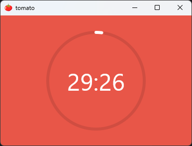

Compose desktop tomato
====
A simple desktop tomato timer for productivity built with Compose Multiplatform(Desktop only).



## Build

To build the project, you can use the following command in project root:

```bash
./gradlew composeApp:run

```
## Build release
To build the release version of the project, you can use the following command in project root:

```bash
./gradlew createReleaseDistributable

```
## Gradle download problem
If you encounter a problem with Gradle download, you can change the Gradle distribution URL in the `gradle-wrapper.properties` file. You can find the file in the `gradle/wrapper` directory. For example, you can change it to:

```properties
distributionUrl=https\://mirrors.cloud.tencent.com/gradle/gradle-8.13-all.zip

```